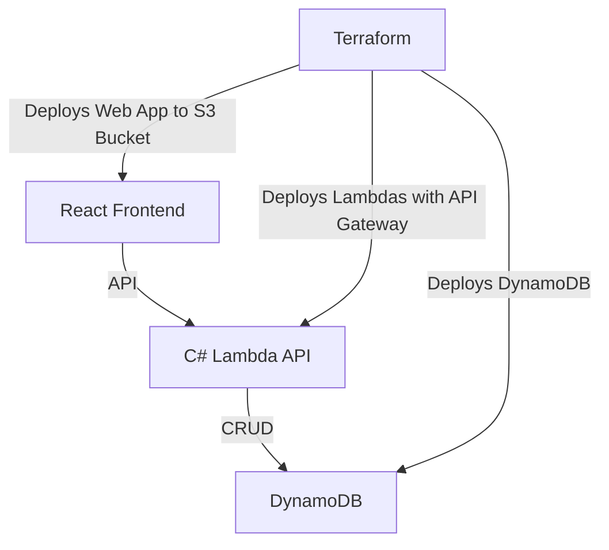

# Introduction
## Brief overview of the project and its goals
- Primary purpose: Customer-facing React application that showcases Products, Baskets, and Orders
- Goal: Showcase the use of AWS services and microservices architecture
# System Architecture Overview: High-level diagram and description of architecture
## Main components: 
### React frontend
### C# Lambda API
Uses DynamoDB
### DynamoDB
Write Services and Terraform
- DynamoDB tables for Products, Baskets, and Orders
- Services for CRUD operations
- Register Services in Justine.Lambdas project
### S3 buckets
### Terraform
#### Deployment process
- Deploy React frontend to an S3 Bucket: Requires Script to build and deploy
- Deploy API Gateway with Lambda functions: Write Terraform for API Gateway and Lambdas
- Build CI/CD pipeline in Terraform for Development, Staging, and Production environments
# Frontend Design
- Overview of React application structure
- Static hosting setup on S3
- REST
# WebSocket communication patterns when DynamoDB is updated
## Write WebSocket code to update the frontend when DynamoDB is updated
- Front end: wscat or
- Back end: WebSocket C# Lambda
# API Design
- Overview of C# Lambda microservice
- Endpoints and expected request/response patterns
- Integration with DynamoDB and S3 for data storage
# Data Design
- Summary of DynamoDB tables and structure
- S3 object storage usage and organization
# Deployment Strategy
- Environments: Development, Staging, Production
- Deployment process for frontend and backend: Terraform
# Security Considerations
- Basic security practices for AWS resources (IAM roles, HTTPS, etc.)
- No authentication or user management required
# Error Handling and Logging
- General approach to error handling in frontend and API
- Logging strategy for Lambda functions: Serilog and Seq for development
# Testing Strategy
- Types of testing (unit, integration, end-to-end)
- Testing environments and tools
# Maintenance and Support
- Guidelines for ongoing maintenance and updates
- Support responsibilities and contact points

---
# Terraform Setup

---
# Architecture Overview
## Microservice AWS microservice architecture

# Handling Throttling Issues using DynamoDB Streams
Taken from blog: https://dynobase.dev/dynamodb-throttling/
A throttled DynamoDB table can significantly impact the performance of your application and ultimately lead to loss of data.
## What is DynamoDB Throttling?
DynamoDB throttling occurs when the number of read or write requests exceeds the provisioned throughput capacity of a table or index. When this happens, DynamoDB returns a `ProvisionedThroughputExceededException` error, indicating that the request was throttled.
## How to Handle Throttling Issues
1. **Use Exponential Backoff**: Implement an exponential backoff strategy in your application to retry failed requests after a delay. This means that if a request fails due to throttling, you wait for a short period before retrying, and if it fails again, you increase the wait time exponentially.
2. **Use DynamoDB Streams**: Enable DynamoDB Streams on your table to capture changes to items in the table. This allows you to process changes asynchronously and can help reduce the load on your main table.
3.  

