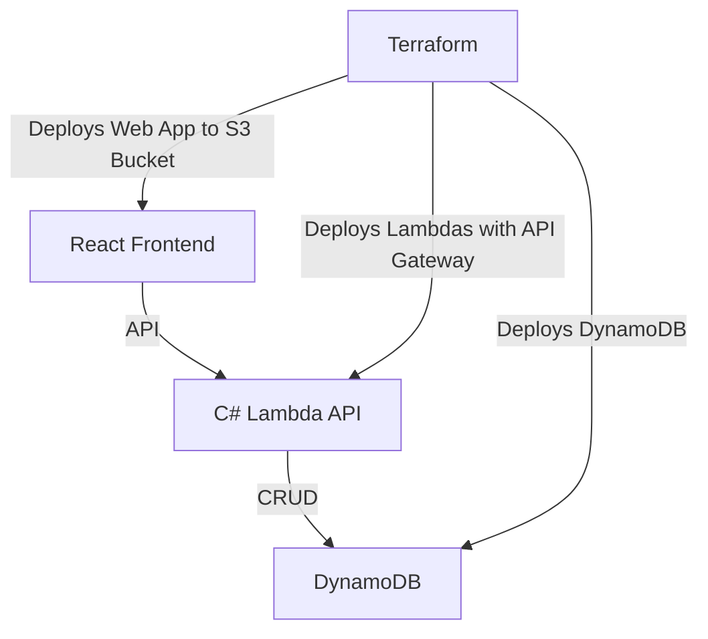
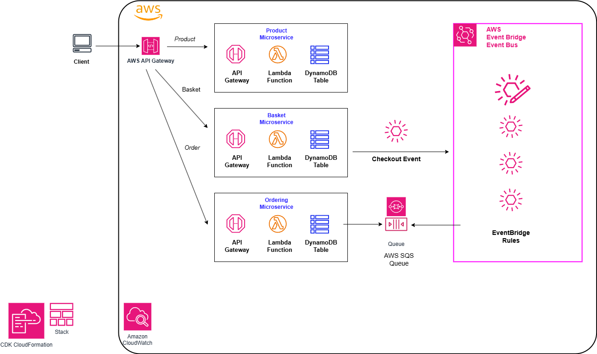

# Introduction
## Brief overview of the project and its goals
- Primary purpose: Customer-facing React application that showcases a 
# System Architecture Overview: High-level diagram and description of architecture
## Main components: 
### React frontend
### C# Lambda API
Change Data Store to DynamoDB
### DynamoDB
Write Terraform
### S3 buckets
### Terraform
#### Deployment process
- Deploy React frontend to an S3 Bucket: Requires Script to build and deploy
- Deploy API Gateway with Lambda functions: Write Terraform for API Gateway and Lambdas
- Build CI/CD pipeline in Terraform for Development, Staging, and Production environments
# Frontend Design
- Overview of React application structure
- Static hosting setup on S3
- REST
# WebSocket communication patterns when DynamoDB is updated
## Write WebSocket code to update the frontend when DynamoDB is updated
- Front end: wscat or
- Back end: WebSocket C# Lambda
# API Design
- Overview of C# Lambda microservice
- Endpoints and expected request/response patterns
- Integration with DynamoDB and S3 for data storage
# Data Design
- Summary of DynamoDB tables and structure
- S3 object storage usage and organization
# Deployment Strategy
- Environments: Development, Staging, Production
- Deployment process for frontend and backend: Terraform
# Security Considerations
- Basic security practices for AWS resources (IAM roles, HTTPS, etc.)
- No authentication or user management required
# Error Handling and Logging
- General approach to error handling in frontend and API
- Logging strategy for Lambda functions: Serilog and Seq for development
# Testing Strategy
- Types of testing (unit, integration, end-to-end)
- Testing environments and tools
# Maintenance and Support
- Guidelines for ongoing maintenance and updates
- Support responsibilities and contact points

---
# Terraform Setup

---
# Architecture Overview
## Microservice AWS microservice architecture

