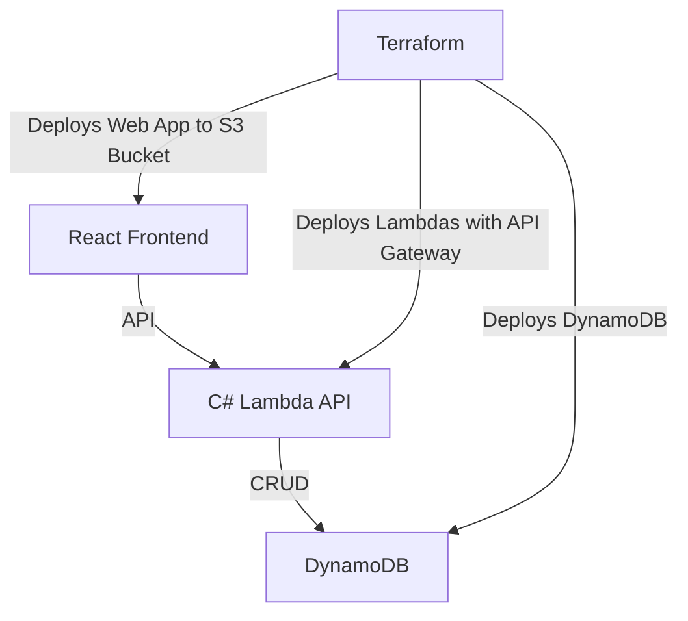
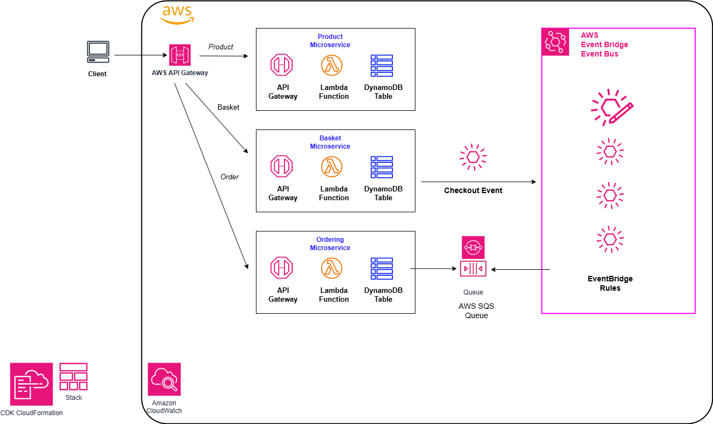

# Introduction
## Upgraded from .NET Core 8 to 10.0.102
https://dotnet.microsoft.com/en-us/download/dotnet/thank-you/sdk-10.0.102-windows-x64-installer
## Brief overview of the project and its goals
- Primary purpose: Customer-facing React application that showcases Products, Baskets, and Orders
- Goal: Showcase the use of AWS services and the microservices pattern Saga

## Install tools


## Install Dependencies
### In package json
```
"@aws-sdk/client-cognito-identity-provider": "^3.817.0",
    "@aws-sdk/client-lambda": "^3.817.0",
    "@aws-sdk/client-s3": "^3.820.0",
    "@aws-sdk/credential-providers": "^3.823.0",

	#### Use chocolatey to install
	choco -v => 2.4.3


	choco install pandoc

	Installed correctly

	pandoc for pdf generation
	pandoc and a LaTeX engine

	Install XeLaTex
	Open bash in admin mode
	choco install texLive

	Takes a bit.
	xelatex --version

	Darn, the install hung.
	choco install texLive --debug --verbose

	texlive - texlive v2026.20260202.0 already installed.

	Got the installer here 
	https://www.tug.org/texlive/acquire-netinstall.html
	Stopped the install, seems shakey


```


## Cognito User Pool and Identity Pool
### User pools: authentication engine
Taken from: https://www.datacamp.com/tutorial/aws-cognito-guide

User pools serve as what I consider the authentication engine within AWS Cognito, 
handling all aspects of user registration, 
sign-in, and profile management. 
They maintain user directories and provide authentication services for applications, 
supporting multiple authentication methods including traditional username/password combinations, 
social identity providers, and SAML-based enterprise identity systems.

### Identity pools: authorization broker
Identity pools function as what I call authorization brokers, 
translating authenticated user identities into temporary AWS credentials. 
Unlike user pools, they do not store user information. 
Instead, they focus on providing controlled access to AWS resources based 
on verified identities from various sources.

### STS: Security Token Service
The core function of identity pools is to provide temporary AWS credentials via the AWS Security Token Service (STS). 
These credentials have limited lifespans and specific permissions, 
following the principle of least privilege. This approach ensures that users and applications 
only have access to the resources they need for their current operations.
What I particularly appreciate about identity pools is how they excel at mapping identities to IAM roles 
through attribute-based rules. This mapping can be based on user attributes, group memberships, 
or other contextual information. The flexibility of this system allows 
for sophisticated authorization schemes that can adapt to different user types and access requirements.

## User pools vs identity pools

•	User pools manage authentication, verifying who the user is. They are ideal for scenarios that require user registration, sign-in workflows, profile management, and integration with external identity providers.
•	Identity pools manage authorization, determining what the user can access. They are used to assign AWS resource access to authenticated users, whether those users come from AWS Cognito user pools or external providers.

## Using JWT tokens for authentication and authorization

The typical authentication workflow begins with user registration, 
where users provide required information and verify their identities through email or SMS confirmation. 
You can customize this process to include additional verification steps 
or integration with external identity systems.
Next is the sign-in process, which involves verifying user credentials against the user pool. 
Upon successful authentication, AWS Cognito issues JSON Web Tokens (JWTs) containing user information. 
These tokens can be used to access protected resources and services. 
Tokens have configurable expiration times and can be refreshed to maintain user sessions 
without requiring reauthentication.
Once users are authenticated, session management becomes crucial to ensure they remain authenticated 
as they interact with the application. AWS Cognito provides built-in mechanisms for token refresh, 
session invalidation, and secure logout. 
Effective session management enhances security while supporting seamless user experiences.

### Auditing and monitoring
AWS Cognito integrates with AWS CloudTrail and Amazon CloudWatch 
to provide comprehensive auditing and monitoring capabilities.
CloudTrail logs all API calls made to AWS Cognito, allowing you to track user activities,
monitor authentication events, and identify potential security issues.
CloudWatch provides real-time monitoring of AWS Cognito metrics, such as sign-in attempts,
failed authentication events, and user pool performance.

## IAM Groups and Roles

### Saga Pattern
- Each microservice has own data store
- Must be able to roll back the transactions (Could use with analytics)
# System Architecture Overview: High-level diagram and description of architecture
## Main components: 
## Security Best Practices
### KMS: Used for Data Encryption
may not need AWS KMS keys for certificate 
management alone, it is advisable to use them if your application involves encrypting sensitive information to ensure security and compliance.

Use API Gateway for in-transit protection (TLS) but not for at‑rest encryption — do both with the right AWS services.
#### In transit
- Enforce HTTPS/TLS (API Gateway + CloudFront); require TLS 1.2+, HSTS.
- Use a custom domain with ACM certificate; consider mutual TLS (mTLS) for client auth.
- Validate and authorize requests (Cognito/OAuth, JWTs, or IAM) and apply AWS WAF.
- Use private integrations or VPC Link so backend traffic stays inside AWS and TLS is used end‑to‑end.
#### At rest
# ------
- Enable server-side encryption (S3 SSE‑KMS, DynamoDB SSE, RDS encryption).
- Use AWS KMS CMKs with least‑privilege key policies and automatic rotation.
- Store secrets in Secrets Manager or Parameter Store (KMS‑encrypted).
- Encrypt Lambda environment variables with KMS.

#### Operational
- Use VPC endpoints, least privilege IAM, CloudTrail/CloudWatch logging, and key rotation/auditing.

# ---------
### React frontend

Use TLS for network traffic
### C# Lambda API
Uses DynamoDB
### DynamoDB
Write Services and Terraform
- DynamoDB tables for Products, Baskets, and Orders
- Services for CRUD operations
- Register Services in Justine.Lambdas project
### S3 buckets

#### Deployment process
- Deploy React frontend to an S3 Bucket: Requires Script to build and deploy
- Deploy API Gateway with Lambda functions: Write Terraform for API Gateway and Lambdas
- Build CI/CD pipeline in Terraform for Development, Staging, and Production environments
# Frontend Design
- Overview of React application structure
- Static hosting setup on S3
- REST
# WebSocket communication patterns when DynamoDB is updated
## Write WebSocket code to update the frontend when DynamoDB is updated
- Front end: wscat or
- Back end: WebSocket C# Lambda
# API Design
- Overview of C# Lambda microservice
- Endpoints and expected request/response patterns
- Integration with DynamoDB and S3 for data storage
# Data Design
- Summary of DynamoDB tables and structure
- S3 object storage usage and organization
# Deployment Strategy
- Environments: Development, Staging, Production
- Deployment process for frontend and backend: Terraform
# Security Considerations
- Basic security practices for AWS resources (IAM roles, HTTPS, etc.)
- No authentication or user management required
# Error Handling and Logging
- General approach to error handling in frontend and API
- Logging strategy for Lambda functions: Serilog and Seq for development
# Testing Strategy
- Types of testing (unit, integration, end-to-end)
- Testing environments and tools
# Maintenance and Support
- Guidelines for ongoing maintenance and updates
- Support responsibilities and contact points

---
# Terraform Setup

```mermaid
graph
	A[React Frontend] -->|API| B[C# Lambda API]
	B -->|CRUD| C[DynamoDB]
	E[Terraform] -->|Deploys Web App to S3 Bucket| A
	E -->|Deploys Lambdas with API Gateway| B
	E -->|Deploys DynamoDB| C
	
```
---
# Architecture Overview
## Microservice AWS microservice architecture



# Handling Throttling Issues using DynamoDB Streams
Taken from blog: https://dynobase.dev/dynamodb-throttling/
A throttled DynamoDB table can significantly impact the performance of your application and ultimately lead to loss of data.
## What is DynamoDB Throttling?
DynamoDB throttling occurs when the number of read or write requests exceeds the provisioned throughput capacity of a table or index. When this happens, DynamoDB returns a `ProvisionedThroughputExceededException` error, indicating that the request was throttled.
## How to Handle Throttling Issues
1. **Use Exponential Backoff**: Implement an exponential backoff strategy in your application to retry failed requests after a delay. This means that if a request fails due to throttling, you wait for a short period before retrying, and if it fails again, you increase the wait time exponentially.
2. **Use DynamoDB Streams**: Enable DynamoDB Streams on your table to capture changes to items in the table. This allows you to process changes asynchronously and can help reduce the load on your main table.


## DNS
- Use Route 53 to manage DNS for your application
- justine-developer.net $100/3 years


